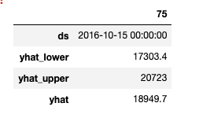
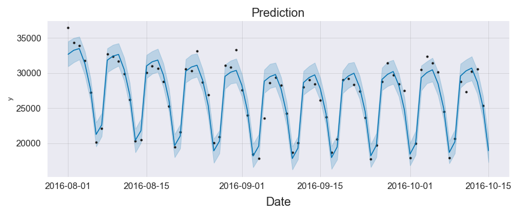

# Summary

## Visits and Searches

- I implemented a decomposable time series model developed by facebook that is accurate and intuitive.
This model works well with time series because it allows control over various kinds of seasonality and trends in the data. 

- After modeling the data we can see that on October-15 we can expect to see approximately 18-20k views on our website. 

