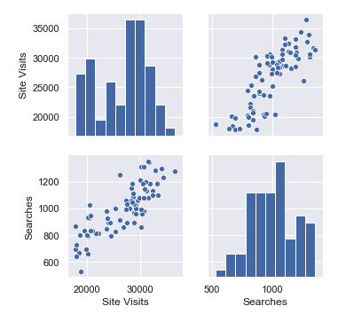
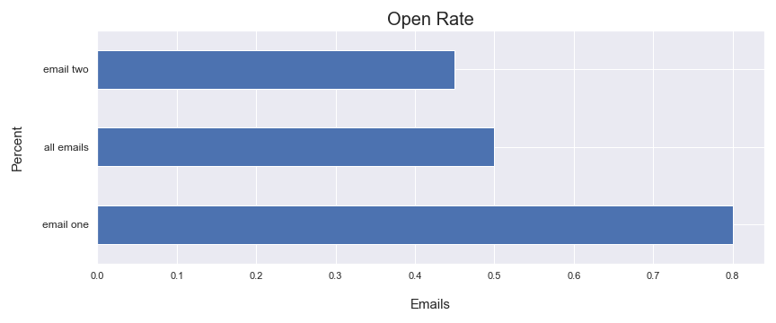
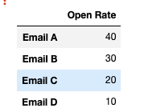

# Summary

## Visits and Searches

- I implemented a decomposable time series model developed by facebook that is accurate and intuitive.
This model works well with time series because it allows control over various kinds of seasonality and trends in the data. 

- After modeling the data we can see that on October-15 we can expect to receive approximately 18-20k views on our website. 

#### Margin of error

### Visits and Searches

- We observe some correlation between searches and web traffic

## Visits and Searches

- I implemented a decomposable time series model developed by facebook that is accurate and intuitive.
This model works well with time series because it allows control over various kinds of seasonality and trends in the data. 

- After modeling the data we can see that on October-15 we can expect to receive approximately 18-20k views on our website. 

#### Margin of error

### Visits and Searches

- We observe some correlation between searches and web traffic

## Email Open Rate
- The data suggests that the first email has an open rate of 80% while the second email has a lower open rate of 45%.  The overall open rate for all emails is around 50%.  This means that email one performed above average while email two fell short.

### All Emails
- When we average our data our combined open rate for emails A,B,C,D
is 25%. 

